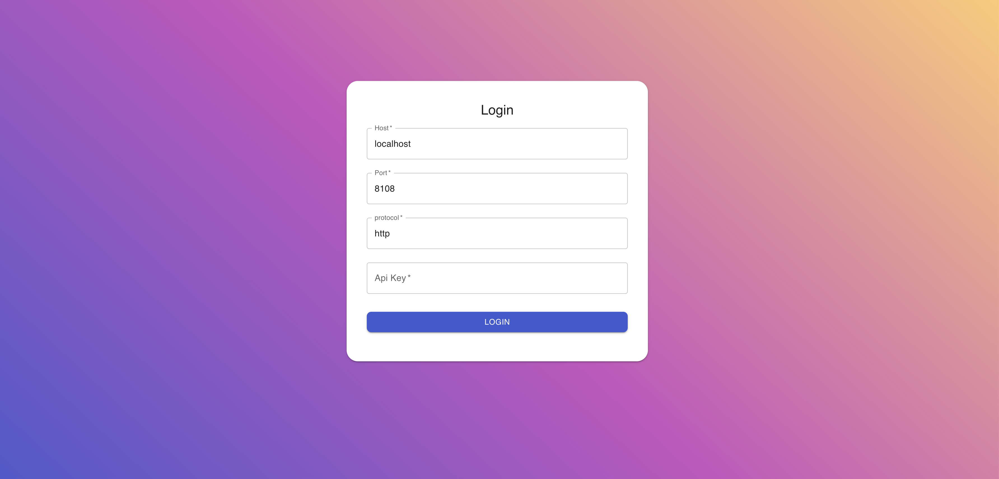
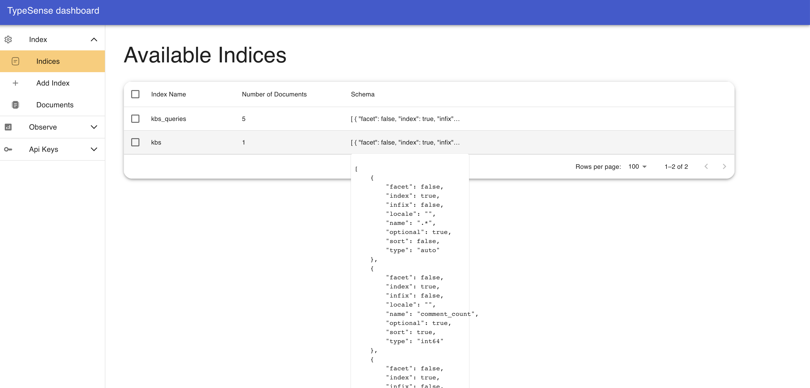
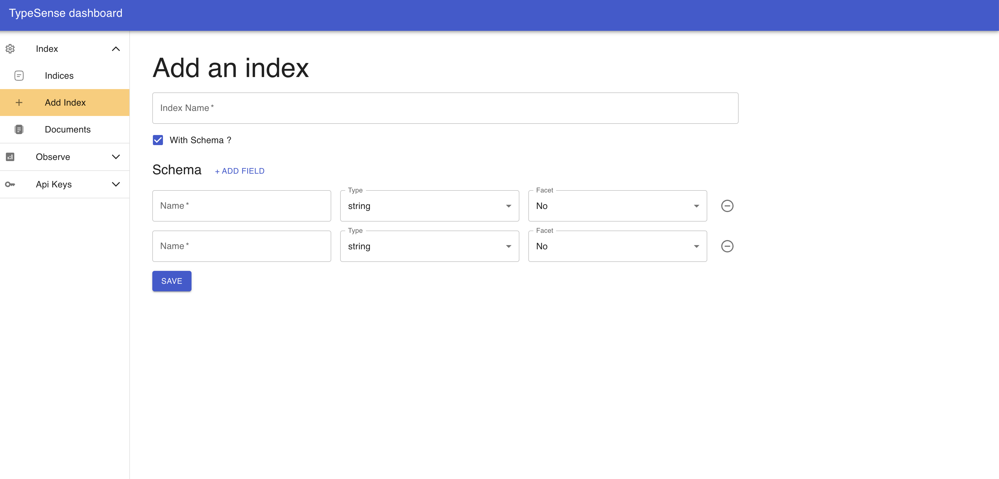
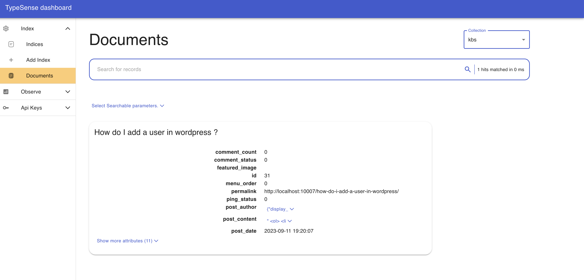
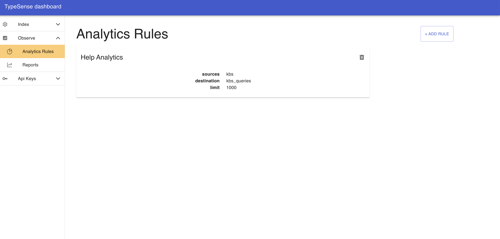
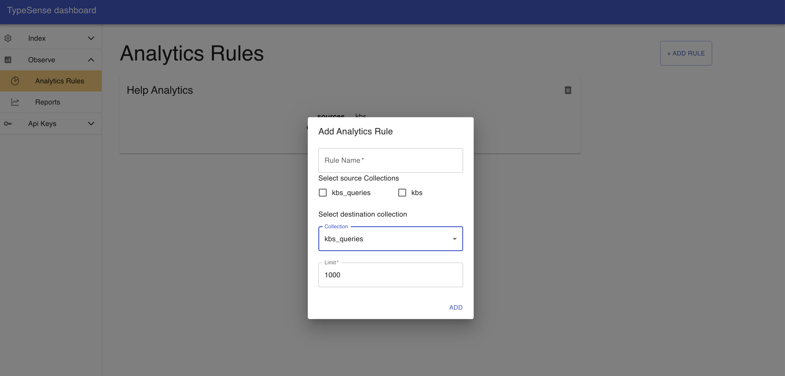
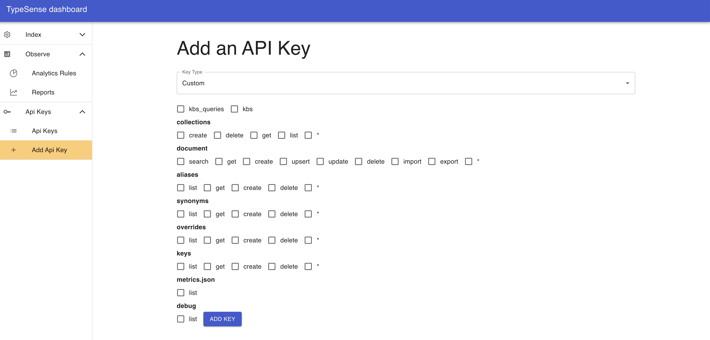

# Typesense Dashboard

Works with a self hosted / local TypeSense instance, to get started with typesense visit:
https://typesense.org/docs/guide/install-typesense.html

Note: You will need the admin key to access this dashboard. Most of the functionalities only work with the admin permissions.

## Available Options

In this dashboard you will have the following sections

### Index ( Collections )

The menu has been called option, corresponds to collections on typesense, with this board you can:
- Look at the available collections and their configurations.
- Bulk clear and delete indexes.
- Add new index with custom or auto schema.

#### Documents

You can select the index and look at the given documents. The dashboard currently tries to set `post_title` as the card title when displaying the document cards.

You can easily search for documents, make sure you select the searchable parameters before searching for documents or the application will break.

Note: The search operation gets auto triggered when you type something in the search text field, with a slight debounce.

### Observe

TypeSense does not seem to have a lot of analytics options, it only supports storing the queries and their counts in an index, to enable analytics, make sure you follow the instructions at:
https://typesense.org/docs/0.25.1/api/analytics-query-suggestions.html#enable-the-feature

After enabling analytics, you can create the corresponding index from +add index option in the dashboard and then add a corresponding analytics rule from this section.

- Allows you to add analytics rules.
- Reports contain the search counts arranged by descending order of counts.

### API Keys

The dashboard allows you to delete and add new API keys with the access level you need, chose from:
- An admin key 
- A search only key (allows you to select collections in case they are available)
- Fine Grained key (allowing you to chose from the list of all available actions and collections)
- API Keys are only visible once created and aren't stored anywhere.

### Visuals

### TODO
- Add error handling.
- Option to remember me for persisting login details / API Keys for longer duration.
- Pagination in documents and queries.
- Configurable card title and image fields.
